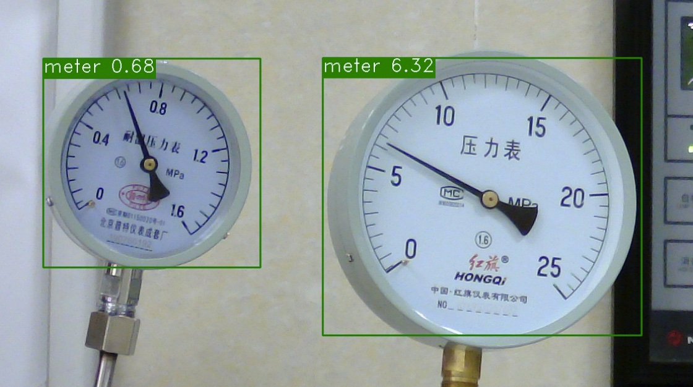

# Meter Reader

> 23Spring 重庆大学计算机学院 深度学习课程项目-任务9

<div align=center>
    
</div>

## 项目简介
在电力能源厂区需要定期监测表计读数，以保证设备正常运行及厂区安全。但厂区分布分散，人工巡检耗时长，无法实时监测表计，且部分工作环境危险导致人工巡检无法触达。针对上述问题，希望通过摄像头拍照->智能读数的方式高效地完成此任务。

## 项目结构
```
├── README.md
├── scripts # 运行脚本
├── train_seg.py # 训练分割模型
├── train_detect.py # 训练检测模型
├── reader.py # 读数
├── data/
    ├── meter_det/ # 表计检测数据集
    ├── meter_seg/ # 指针和刻度分割数据集
├── results/ # 模型输出
├── checkpoints/ # 预训练模型
```

## 项目运行

## 目标检测


## 分割 PP-YOLOv2


## 读数 DeepLabv3+

## 实验结果及参数


## 参考文献
- [1] [DeepLabv3+](https://arxiv.org/abs/1802.02611)
- [2] [PP-YOLOv2](https://arxiv.org/abs/2104.10419)