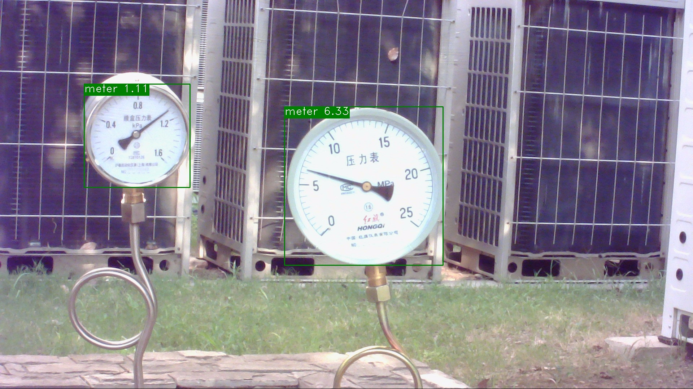
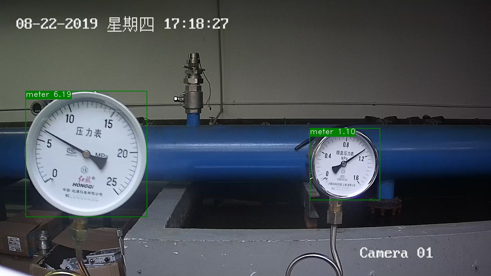
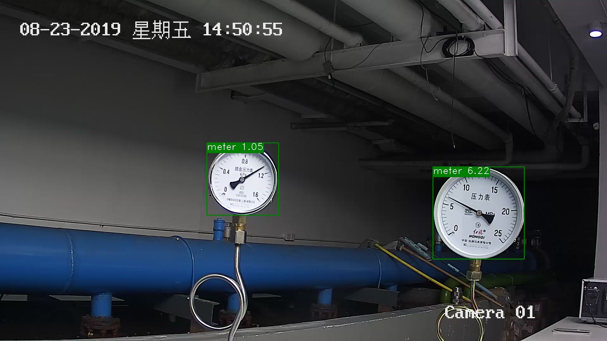
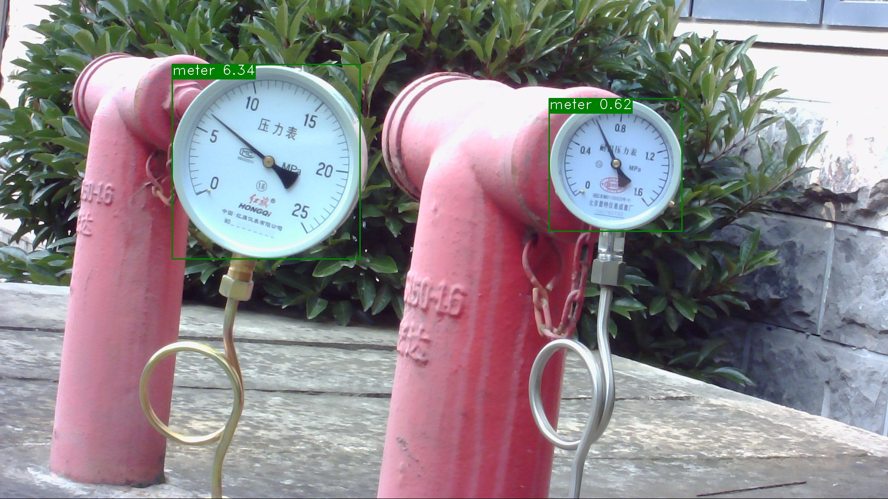

# Meter Reader

> 23Spring 重庆大学计算机学院 深度学习课程项目-任务9

<div align=center>
    
</div>

## 1. 项目简介
在电力能源厂区需要定期监测表计读数，以保证设备正常运行及厂区安全。但厂区分布分散，人工巡检耗时长，无法实时监测表计，且部分工作环境危险导致人工巡检无法触达。针对上述问题，希望通过摄像头拍照->智能读数的方式高效地完成此任务。

## 2. 项目结构
```
├── README.md
├── scripts # 运行脚本
├── train_seg.py # 训练分割模型
├── train_detect.py # 训练检测模型
├── reader.py # 读数
├── meter_det/ # 表计检测数据集
├── meter_seg/ # 指针和刻度分割数据集
├── results/ # 模型输出
├── checkpoints/ # 预训练模型
```

## 3. 项目运行
### 3.1 目标检测训练
```bash
python train_detect.py
```

### 3.2 分割训练
```bash
python train_seg.py
```

### 3.3 读数
```bash
python reader.py --det_model_dir output/ppyolov2_r50vd_dcn/best_model \
                 --seg_model_dir output/deeplabv3p_r50vd/best_model/ \
                 --image_dir data/meter_det/test/
```

## 4. 检测 PP-YOLOv2
> !TODO: 补充原理

## 5. 分割 DeepLabv3+
> !TODO: 补充原理

## 6. 读数 
> !TODO: 补充原理

## 7. 实验环境
- 系统环境: Ubuntu 22.04
- Python版本: 3.8.5
- PaddlePaddle版本: 2.1.2
- PaddleX版本: 2.0

## 8. 实验结果
### 8.1 目标检测
| 模型 | bbox_mmap | 模型权重 |
| :---: | :---: | :---: |
| PP-YOLOv2 | 100% | [下载](https://drive.google.com/file/d/1Twnf-m_bbJzN8ZazhWyuvYuqPIpuvu5x/view?usp=sharing) |

使用在COCO上训练得到的预训练模型，在单块V100-32G上训练14小时，共训练170个epcoh，最终bbox_mmap达到100%
### 8.2 分割
| 模型 | mIoU | 模型权重 |
| :---: | :---: | :---: |
| DeepLabv3+ | 0.8443 | [下载](https://drive.google.com/file/d/1_dpVGaVop6ZpEW4JTRp1HjjRtDmz8JqC/view?usp=sharing) |

使用在IMAGENET上训练得到的预训练模型，在单块V100-32G上训练1小时，共训练50个epcoh，最终mIoU达到0.8443
### 8.3 实验结果
对测试集中的所有图片进行测试，最终在58张测试图片中，只有2张图片的读数错误，预测准确率达到96.55%

部分实验结果如下图所示:
<table>
  <tr>
    <td></td>
    <td></td>
  </tr>
  <tr>
    <td></td>
    <td></td>
  </tr>
</table>

## 9. 参考文献
- [1] [DeepLabv3+](https://arxiv.org/abs/1802.02611)
- [2] [PP-YOLOv2](https://arxiv.org/abs/2104.10419)
